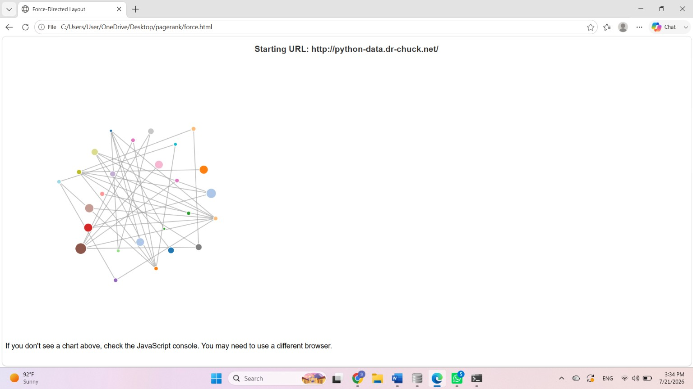
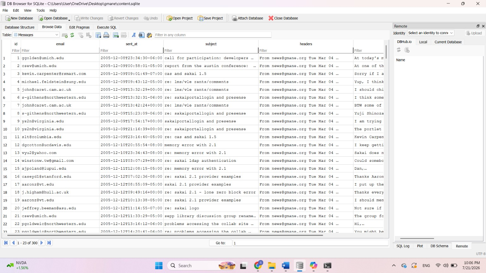
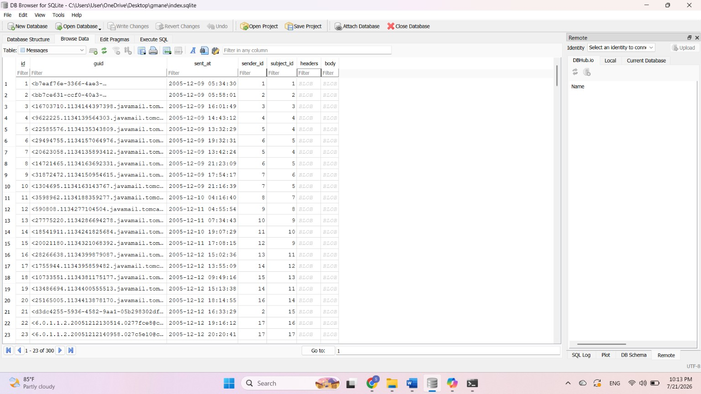
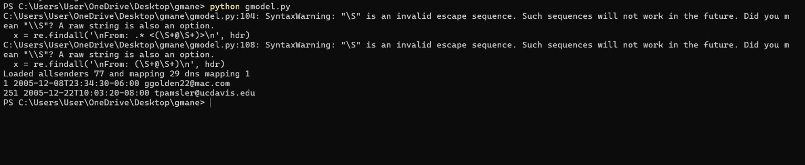
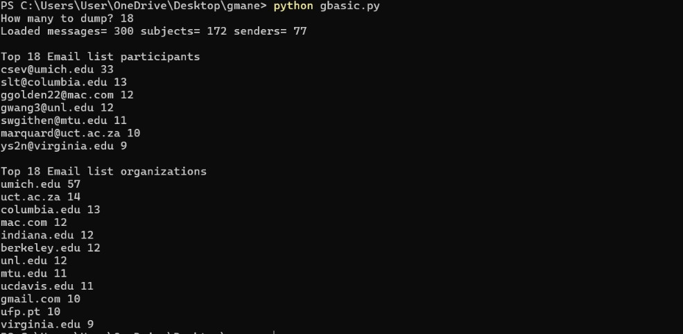
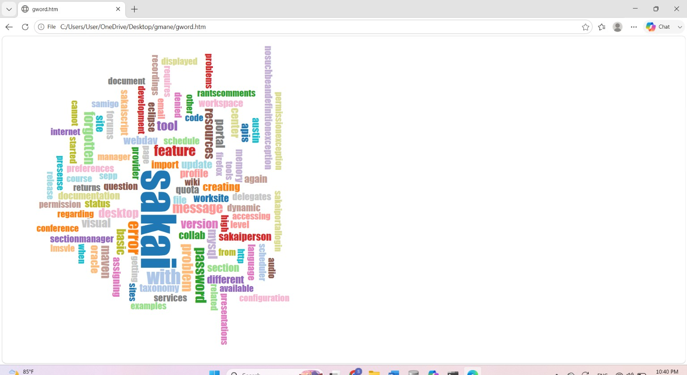
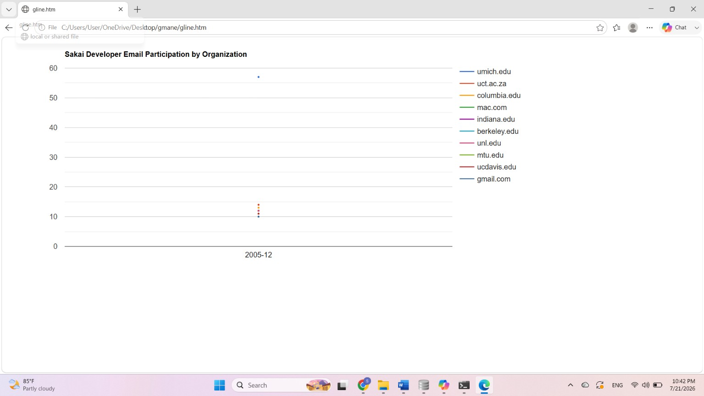

# Python Web Data & Visualization Capstone Projects

This repository showcases my completed projects from advanced Python data courses, focusing on web crawling, database management, PageRank algorithms, and interactive email archive visualizations.

---

## 📂 Projects Included

### 1. PageRank & Web Spider Visualization (`pagerank`)
- **Description:** Built a web spider to crawl websites, stored relationship data in an SQLite database, executed the PageRank algorithm, and visualized the linked network graph using D3.js.
- **Key Features:**
  - Web crawling and database storage (`sprank.py`, `spdump.py`)
  - Force-directed network layout (`force.html`)

**Project Previews:**
* **Network Graph Layout:**
  
  

* **PageRank Terminal Execution:**
  
  

---

### 2. Gmane Email Archive Analysis & Visualization (`gmane`)
- **Description:** Parsed email archive messages, processed texts, managed SQLite databases (`content.sqlite` and `index.sqlite`), analyzed organization participation, and generated interactive visual HTML outputs.
- **Key Features:**
  - Database parsing and structuring (`gmodel.py`, `gbasic.py`)
  - Word cloud text generation (`gword.htm`)
  - Timeline visualization of email participation by organization (`gline.htm`)

**Project Previews:**
* **Database Structure (`content.sqlite`):**
  
  

* **Database Structure (`index.sqlite`):**
  
  

* **Model Processing Output:**
  
  

* **Basic Analysis Output:**
  
  

* **Word Cloud Visualization (`gword.htm`):**
  
  

* **Timeline Visualization (`gline.htm`):**
  
  

---

## 🛠️ Technologies Used
- **Python** (Core data parsing, scripting, PageRank logic)
- **SQLite & DB Browser** (Relational database management)
- **HTML / JavaScript & D3.js** (Interactive network and data visualizations)

---

## 📜 Certification
* **Coursera Specialization Certificate:** [View Certificate](https://www.coursera.org/account/accomplishments/specialization/certificate/FXQ5S9F1KUCD)
